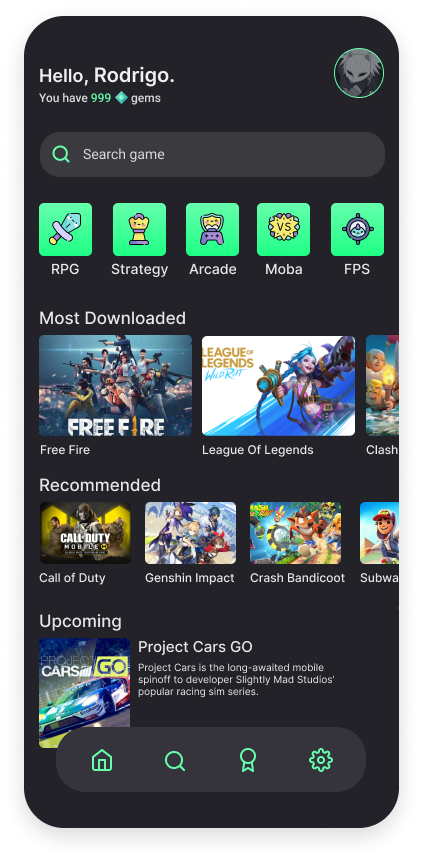

<h1 align="center">Game Store</h1>

<h4 align="center">Homepage of a fictitious game store app made with React Native.</h4>

<p align="center">
  You can check the design on my <a href="https://dribbble.com/rodrigocabral">dribbble</a>
</p>

<br/>
<div align="center">
  
</div>
<br />

## 🚀 Technologies

- [React Native (expo)](https://expo.io)
- [Typescript](https://www.typescriptlang.org)

## 🚀 How to use

To clone and run this application, you'll need [Git](https://git-scm.com), [Node.js](https://nodejs.org/) + [Npm](https://www.npmjs.com) installed on your computer. From your command line:

```bash
# Clone this repository
$ git clone https://github.com/rodcabral/gamestore

# Go into the repository
$ cd gamestore

# Install dependencies
$ npm install 

# Run the app
$ expo start
```

---
Made with 💖 by [Rodrigo Cabral](https://linkedin.com/in/rodcabral)
